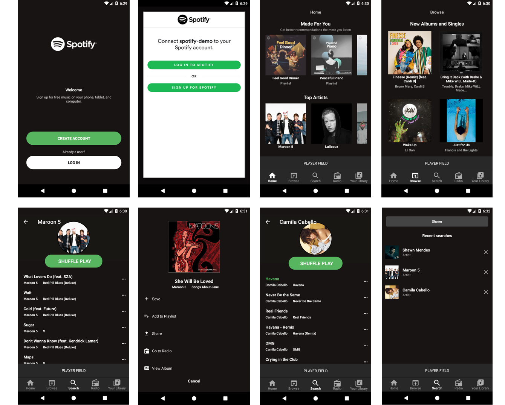

# spotify-demo (work-in-progress 👷🔧️👷‍♀️⛏)
Music player app using the Spotify Android SDK to play an audio track.

[](https://github.com/junlee91/android-spotify-demo/blob/master/screenshot/screens.png)

## YouTube Demo
- [Login](https://youtu.be/Td9k2k80iac)
- [Navigation and Search](https://youtu.be/0BnT-iWdWIQ)
- [Playback](https://youtu.be/QJZFqSbEHJw)

## Getting Started
- Clone this repo:
```sh
https://github.com/junlee91/android-spotify-demo.git
```
- Open the project in Android Studio
- Make sure to have `buildToolsVersion "26.0.2"`

## Installing Spotify Android SDK
You can follow the [Spotify Android SDK Tutorial](https://developer.spotify.com/technologies/spotify-android-sdk/tutorial/) to start the set up.

### Quick step
- Download the [Spotify Android playback library zip](https://github.com/spotify/android-sdk/) and [Spotify Android auth library zip](https://github.com/spotify/android-auth/) from GitHub and unzip them.
- In a file explorer (not Android Studio), drag the unzipped spotify-auth-version.aar and spotify-player-version.aar files into the /app/libs directory in your project’s root directory.
- Playback library can be found when you unzip the zipfile. And simply copy this .aar into app/libs
- Auth library needs some more steps.

### Build .aar for auth library
- Download and unzip
- Remove the auth-sample directory since it is not needed to create .aar file
- In the `\android-auth-1.0\settings.gradle` file, include `':app'`
- Create `\android-auth-1.0\local.properties` and add `sdk.dir=/Users/%YOUR_PC_USERNAME%/Library/Android/sdk` for path to the Android SDK
- Run `./gradlew build` and grab an artifact from `auth-lib/build/outputs/aar/`.

## Generate SHA1 
This step is needed for registering application fingerprint
```sh
echo -n password | shasum -a 1 | awk '{print $1}'
```

## Get data from Spotify Web API
- [Spotify Web API for Android](https://github.com/kaaes/spotify-web-api-android)
- [Documentation](http://kaaes.github.io/spotify-web-api-android/)

## ScalingLayout
- Follow the instructions from [here](https://github.com/iammert/ScalingLayout)

## Dependency
If you use Android Studio as recommended, the following dependencies will automatically be installed by Gradle.
```sh
android{
    vectorDrawables.useSupportLibrary = true
}

repositories {
    mavenCentral()
    flatDir {
        dirs 'libs'
    }
    maven { url "https://jitpack.io" }
}

dependencies {
    ...
    compile 'com.github.iammert:ScalingLayout:1.1'
    compile 'com.android.support:recyclerview-v7:26.1.0'
    compile 'com.squareup.picasso:picasso:2.5.2'
    compile 'de.hdodenhof:circleimageview:2.2.0'

    compile 'com.spotify.sdk:spotify-android-auth-1.0.0@aar'
    compile 'com.spotify.sdk:spotify-player-24-noconnect-2.20b@aar'
    compile 'com.github.kaaes:spotify-web-api-android:0.4.1'
}
``` 